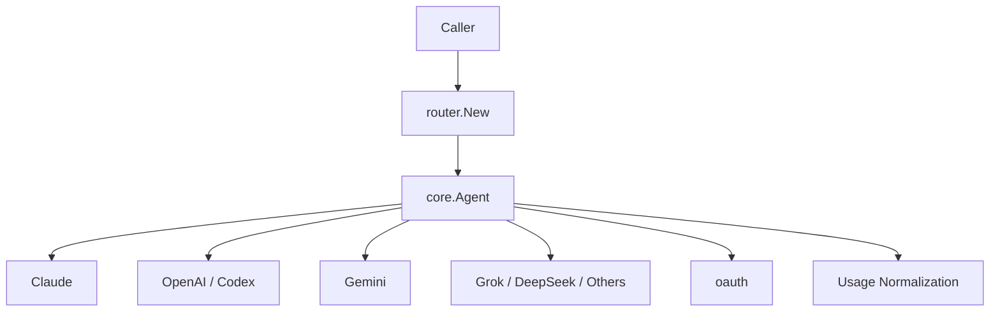

> [!NOTE]
> This README was generated by [SKILL](https://github.com/agenvoy/skill-readme-generate), get the ZH version from [here](./doc/README.zh.md).

***

<strong>ONE AGENT INTERFACE FOR EVERY LLM PROVIDER</strong>

***

> A Go LLM router library with a unified Agent interface, multi-provider routing, and normalized token usage

> Extracted as a standalone package from `Agenvoy` [2741d4a](https://github.com/agenvoy/Agenvoy/commit/2741d4a3be70c5bfac1bba9e1d5d54a65db15acd)
>
> **Since v0.28.17**, Agenvoy's LLM providers are unified and replaced by this package `go-llm-router`.

## Table of Contents

- [Features](#features)
- [Architecture](#architecture)
- [License](#license)
- [Author](#author)

## Features

> `go get github.com/pardnchiu/go-llm-router` · [Documentation](./doc/doc.md)

- **Unified Agent Interface** — Twelve providers share one `Send` surface so callers never write per-vendor adapters.
- **String Routing Factory** — Build the right Agent from a `provider@model` name, with bracket tags and custom endpoints.
- **Reasoning Level Normalization** — Map `none` through `xhigh` onto Claude thinking, Gemini budgets, OpenAI effort, and more.
- **Cross-Provider Usage Absorption** — Fold `prompt_tokens` / `input_tokens` and cache fields into one Input / Output / Cache shape.
- **OAuth and Image Extensions** — Built-in Copilot / Codex / Grok OAuth flows, plus Codex image generation and multimodal input.

## Architecture

> [Full Architecture](./doc/architecture.md)

## License

This project is licensed under the [MIT LICENSE](LICENSE).

## Author

<h4 style="padding-top: 0">邱敬幃 Pardn Chiu</h4>

<a href="mailto:hi@pardn.io">hi@pardn.io</a> 
<a href="https://www.linkedin.com/in/pardnchiu">https://www.linkedin.com/in/pardnchiu</a>

***

©️ 2026 [邱敬幃 Pardn Chiu](https://pardn.io)
