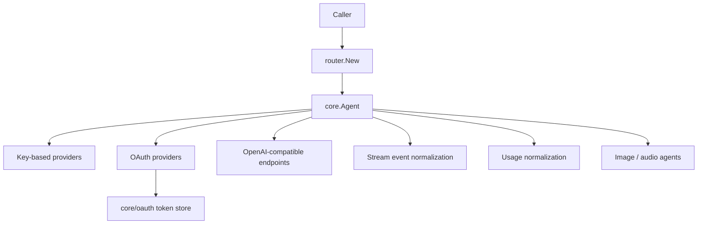

> [!NOTE]
> This README was generated by [SKILL](https://github.com/agenvoy/skill-readme-generate), get the ZH version from [here](./doc/README.zh.md).

***

<strong>ONE AGENT INTERFACE FOR EVERY LLM PROVIDER</strong>

***

> A Go LLM router library with a unified Agent interface, a string routing factory, and cross-provider usage normalization

> Extracted as a standalone package from `Agenvoy` [2741d4a](https://github.com/agenvoy/Agenvoy/commit/2741d4a3be70c5bfac1bba9e1d5d54a65db15acd)
>
> **Since v0.28.17**, Agenvoy's LLM providers are unified and replaced by this package `go-llm-router`.

## Table of Contents

- [Features](#features)
- [Architecture](#architecture)
- [License](#license)
- [Author](#author)

## Features

> `go get github.com/pardnchiu/go-llm-router` · [Documentation](./doc/doc.md)

- **Unified Agent Interface** — Fourteen providers share one `Send` / `SendStream` contract, so callers never write per-vendor adapters.
- **String Routing Factory** — Resolve an Agent from a `provider@model` name; an unknown prefix falls through to an OpenAI-compatible endpoint as a named instance.
- **Reasoning Level Normalization** — Six levels from `none` to `max` map onto Claude thinking, Gemini budgets, and OpenAI effort, clamped to each model's range.
- **Usage Field Absorption** — `prompt_tokens` / `input_tokens` and every cache variant fold into a single Input / Output / Cache shape.
- **Multimodal and OAuth Extensions** — Built-in Copilot / Codex / Grok OAuth flows, plus image generation, speech-to-text, and text-to-speech agents.

## Architecture

> [Full Architecture](./doc/architecture.md)

## License

This project is licensed under the [MIT LICENSE](LICENSE).

## Author

Just [open an issue](https://github.com/pardnchiu/go-llm-router/issues/new) to share an idea.

***

©️ 2026 [邱敬幃 Pardn Chiu](https://www.linkedin.com/in/pardnchiu)
