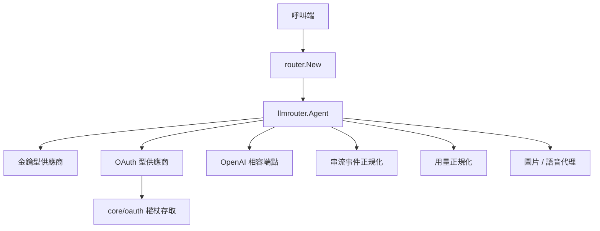

> [!NOTE]
> 此 README 由 [SKILL](https://github.com/agenvoy/skill-readme-generate) 生成，英文版請參閱 [這裡](../README.md)。

***

<strong>ONE AGENT INTERFACE FOR EVERY LLM PROVIDER</strong>

***

> Go LLM 路由函式庫，具備統一 Agent 介面、字串路由工廠與跨供應商用量正規化

> 自 `Agenvoy` [2741d4a](https://github.com/agenvoy/Agenvoy/commit/2741d4a3be70c5bfac1bba9e1d5d54a65db15acd) 抽離為獨立套件
>
> **自 v0.28.17 起**，Agenvoy 的 LLM 供應商全面改由本套件 `go-llm-router` 提供。

## 目錄

- [功能特點](#功能特點)
- [架構](#架構)
- [授權](#授權)
- [Author](#author)

## 功能特點

> `go get github.com/pardnchiu/go-llm-router` · [完整文件](./doc.zh.md)

- **統一 Agent 介面** — 十四個供應商共用同一組 `Send` / `SendStream` 契約，呼叫端不必為每家廠商寫轉接層。
- **字串路由工廠** — 以 `provider@model` 取得對應 Agent，未知前綴自動落到 OpenAI 相容端點成為具名實例。
- **推理等級正規化** — `none` 到 `max` 六級對映到 Claude thinking、Gemini budget、OpenAI effort，並依模型上下限自動收斂。
- **用量欄位吸收** — `prompt_tokens` / `input_tokens` 與各式快取欄位折疊成單一 Input / Output / Cache 形狀。
- **多模態與 OAuth 延伸** — 內建 Copilot / Codex / Grok OAuth 流程，以及圖片生成、語音轉文字與文字轉語音代理。

## 架構

> [完整架構](./architecture.zh.md)

## 授權

本專案採用 [MIT LICENSE](../LICENSE)。

## Author

Just [open an issue](https://github.com/pardnchiu/go-llm-router/issues/new) to share an idea.

***

©️ 2026 [邱敬幃 Pardn Chiu](https://www.linkedin.com/in/pardnchiu)
