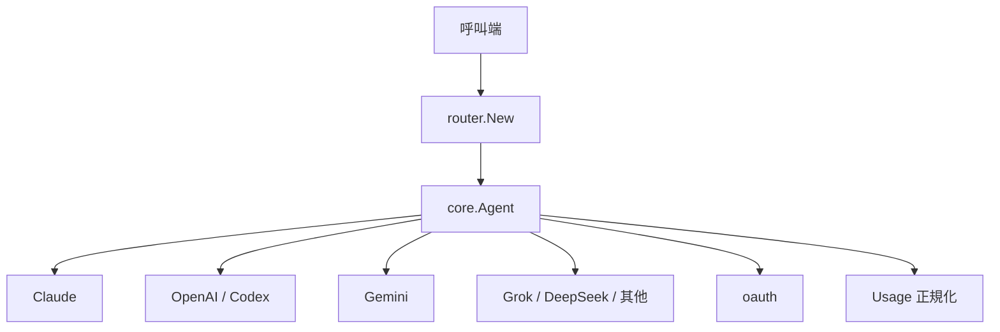

> [!NOTE]
> 此 README 由 [SKILL](https://github.com/agenvoy/skill-readme-generate) 生成，英文版請參閱 [這裡](../README.md)。

***

<strong>ONE AGENT INTERFACE FOR EVERY LLM PROVIDER</strong>

***

> Go LLM 路由函式庫，具備統一 Agent 介面、多供應商路由與正規化 token 用量

> 從 `Agenvoy` [2741d4a](https://github.com/agenvoy/Agenvoy/commit/2741d4a3be70c5bfac1bba9e1d5d54a65db15acd) 移出為獨立套件
>
> Agenvoy **v0.28.17 起**，LLM provider 統一改用本套件 `go-llm-router` 取代。

## 目錄

- [功能特點](#功能特點)
- [架構](#架構)
- [授權](#授權)
- [Author](#author)

## 功能特點

> `go get github.com/pardnchiu/go-llm-router` · [完整文件](./doc.zh.md)

- **統一 Agent 介面** — 十二家供應商共用 `Send` 介面，呼叫端無需為各家 API 寫適配層。
- **字串路由工廠** — 以 `provider@model` 字串一次建立對應 Agent，支援括號標籤與自訂 endpoint。
- **推理層級正規化** — 將 `none` 到 `xhigh` 統一映射到 Claude thinking、Gemini budget、OpenAI effort 等各家機制。
- **跨供應商用量吸收** — 自動吸收 `prompt_tokens`／`input_tokens` 與 cache 欄位差異，輸出一致的 Input／Output／Cache 計數。
- **OAuth 與影像擴充** — 內建 Copilot／Codex／Grok OAuth 流程，Codex 另支援影像生成與多模態輸入。

## 架構

> [完整架構](./architecture.zh.md)

## 授權

本專案採用 [MIT LICENSE](../LICENSE)。

## Author

<h4 style="padding-top: 0">邱敬幃 Pardn Chiu</h4>

<a href="mailto:hi@pardn.io">hi@pardn.io</a> 
<a href="https://www.linkedin.com/in/pardnchiu">https://www.linkedin.com/in/pardnchiu</a>

***

©️ 2026 [邱敬幃 Pardn Chiu](https://pardn.io)
