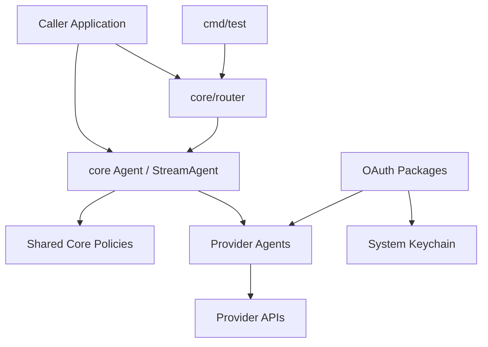
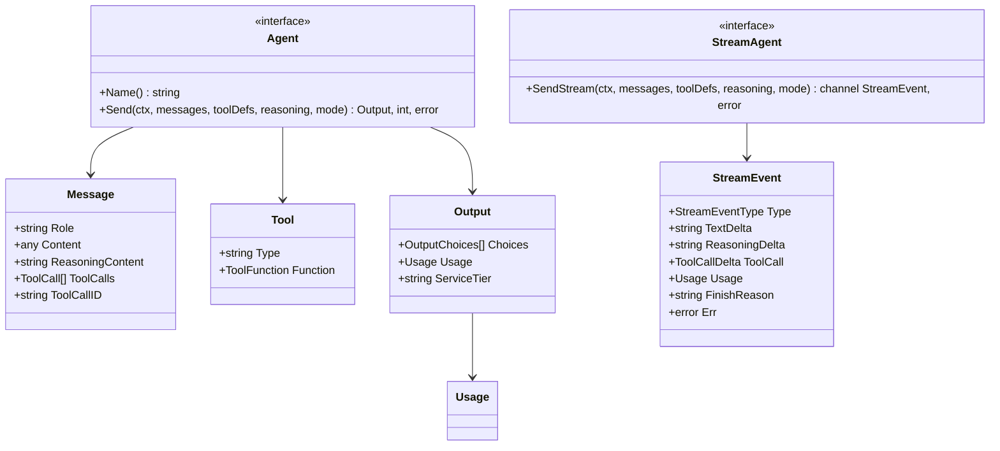
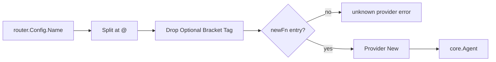
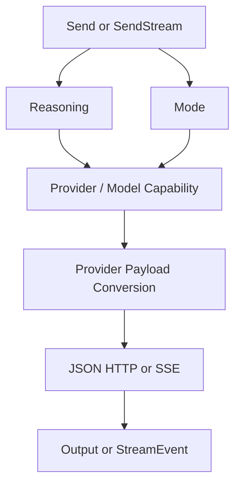
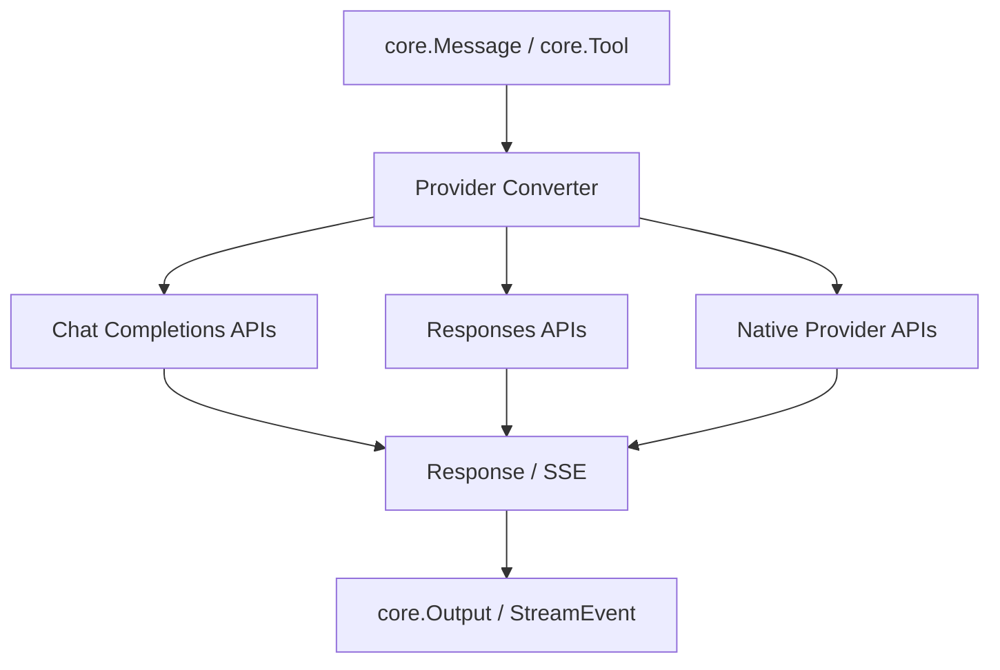
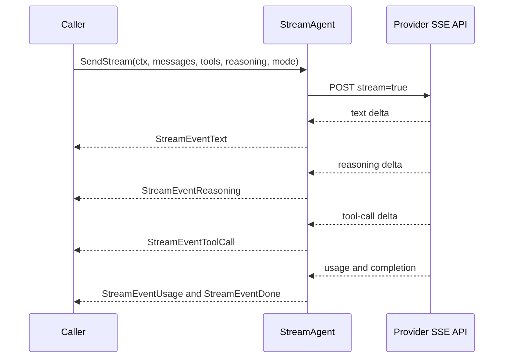
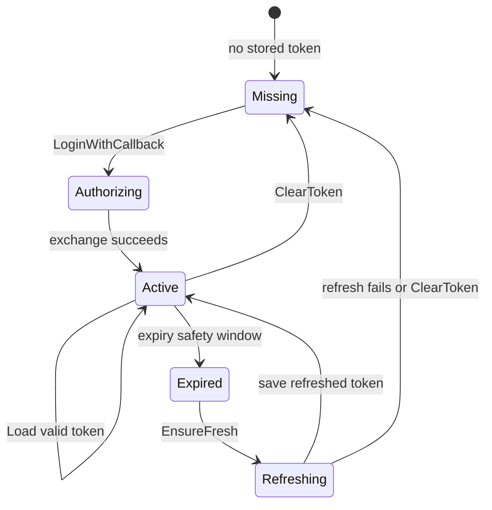
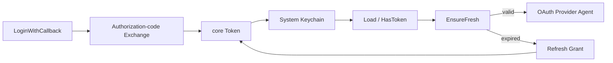
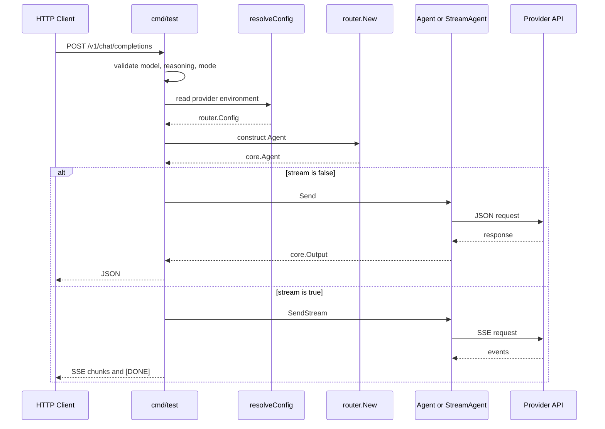
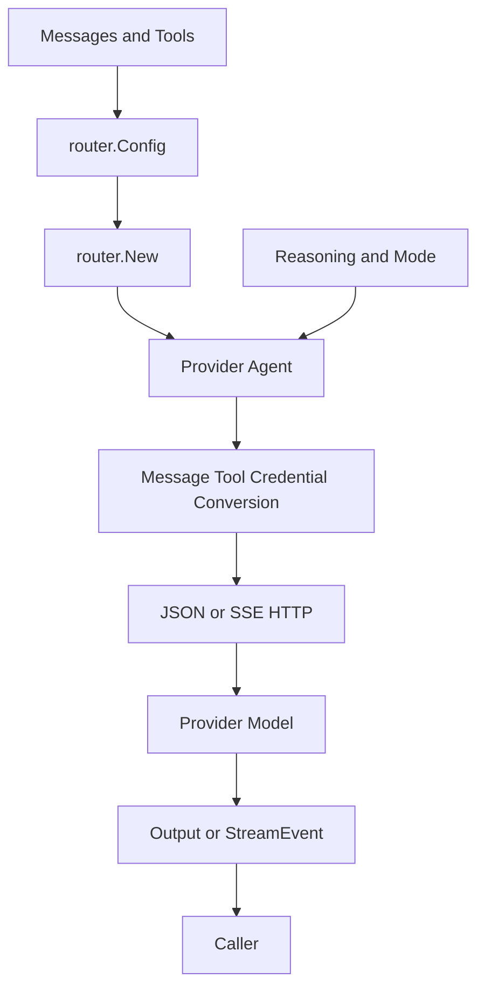

# go-llm-router - Architecture

> Back to [README](../README.md)

## Overview

`go-llm-router` exposes a stable Go API over multiple LLM provider protocols. Callers either create a concrete provider directly or pass a `provider@model` identifier to `core/router`. Both paths use the same message, tool, reasoning, mode, response, and streaming contracts.

| Layer | Packages | Responsibility |
|---|---|---|
| Caller | Application code, `cmd/test` | Build messages and tools; choose model, reasoning, mode, and synchronous or streaming consumption |
| Router | `core/router` | Parse a provider name and construct the matching `core.Agent` |
| Shared core | `core` | Define transport-neutral types, reasoning and fast-mode policy, and HTTP client defaults |
| Provider adapter | `core/<provider>` | Authenticate, convert payloads, select provider endpoints, and normalize responses |
| OAuth | `core/oauth/*` | Login, token storage, expiry checks, and refresh paths |

## Module: Core Contracts

`core/type.go` is the public cross-provider boundary. Adapters return normalized `Output`, `Usage`, and `StreamEvent` values rather than native upstream responses.

| Type | Role |
|---|---|
| `Message` | A text or multipart conversation item, including reasoning, tool calls, and tool-result linkage |
| `Tool` / `ToolFunction` | OpenAI-style function definition with JSON Schema parameters |
| `Output` / `OutputChoices` | Normalized non-streaming response, finish reason, usage, optional service tier, and error payload |
| `Usage` | Unified input, output, cache-creation, and cache-read token counters |
| `StreamEvent` | Typed text, reasoning, tool-call, usage, completion, and error deltas |
| `Config` | Shared model, credential, custom endpoint, and Cloudflare account/gateway construction settings |

## Module: Router

`router.New` gets the substring before `@`, removes any `[tag]`, looks up the provider factory, and returns a unified Agent. Unknown provider keys return an error.

| Provider key | Constructor | Required configuration |
|---|---|---|
| `claude`, `openai`, `gemini`, `grok`, `deepseek`, `nvidia`, `openrouter` | Matching package `New` | `APIKey` |
| `cloudflare` | `cloudflare.New` | `APIKey`, `AccountID`, `GatewayID` |
| `compat` | `compat.New` | `BaseURL`; optional `APIKey` |
| `copilot`, `codex`, `grok-oauth` | OAuth-backed package `New` | `Token` |

## Module: Request Policy

The core standardizes call parameters but deliberately leaves wire payloads to adapters.

### Reasoning

`Reasoning` supports `none`, `low`, `medium`, `high`, `xhigh`, and `max`; `medium` is the default. `ParseReasoning` also accepts `minimal`, `extra`, and `ultra`. Provider adapters use range and effort helpers, including `ClampReasoning` and `OpenAIEffortRange`, before formatting native controls.

### Fast Mode

`ModeFast` is a capability request, not a universal guarantee. `core.SupportFast` checks the provider/model pair, while `core.WarnFastDowngrade` logs any returned downgrade.

| Provider route | Native fast-mode control |
|---|---|
| Claude | `speed: "fast"` and the fast-mode beta header |
| OpenAI | `service_tier: "fast"` |
| Grok and Grok OAuth | `service_tier: "priority"` |
| OpenRouter | `service_tier: "priority"` for supported routed models |
| Other adapters | No fast-tier field currently added |

## Module: Provider Adapters

Each adapter owns system-prompt handling, message and tool conversion, authentication, endpoint selection, and upstream response decoding.

| Module | API form | Implementation focus |
|---|---|---|
| `claude` | Anthropic Messages | Tool/image conversion, prompt caching, thinking, fast mode, and public streaming |
| `openai` | Chat Completions or Responses | Model-driven endpoint choice, `instructions`, reasoning effort, and fast tier |
| `gemini` | `generateContent` | Content and function-declaration conversion, cache support, schema cleanup, and synthetic-skill rewrite |
| `grok` | Chat Completions | Reasoning effort and priority service tier |
| `grokOauth` | Responses via SSE | OAuth authentication and internal SSE assembly into one output |
| `copilot` | Chat Completions or Responses | Endpoint-capability lookup/cache, OAuth authentication, and public streaming |
| `openaiCodex` | ChatGPT Codex Responses via SSE | OAuth authentication, prompt-cache key, internal SSE assembly, and image generation |
| `deepseek` | Chat Completions | System-prompt merge and assistant reasoning placeholder |
| `nvidia` | Chat Completions | System-prompt merge and reasoning-effort mapping |
| `openRouter` | Chat Completions | Reasoning-detail preservation and supported priority tier |
| `cloudflare` | Workers AI Run | Content flattening and account/gateway request configuration |
| `compat` | Custom Chat Completions | Standard OpenAI-style payload to a supplied base URL |

## Module: Public Streaming

Providers that implement `core.StreamAgent` translate upstream SSE events to common event values. The caller can use a type assertion without depending on provider-specific event names.

| Event | Meaning |
|---|---|
| `text` | Output-text delta |
| `reasoning` | Reasoning-summary or reasoning-text delta |
| `tool_call` | Tool-call ID, name, or argument fragment |
| `usage` | Normalized token counters |
| `done` | Completion reason such as `stop` or `tool_calls` |
| `error` | Upstream, read, or decode error |

Claude and Copilot expose `SendStream`. Codex and Grok OAuth consume provider SSE inside their public `Send` implementation, then return a completed `core.Output`.

## Module: OAuth Lifecycle

OAuth adapters persist JSON token values in the operating-system keychain. Codex and Grok expiry checks use a 60-second safety buffer, then refresh and persist a replacement token when needed.

| OAuth package | Token type | Primary key |
|---|---|---|
| `core/oauth/copilot` | `core.CopilotToken` | `COPILOT_OAUTH_TOKEN`, plus legacy compatibility |
| `core/oauth/codex` | `core.CodexToken` | `CODEX_OAUTH_TOKEN`, plus `agenvoy.codex.token` compatibility |
| `core/oauth/grok` | `core.GrokToken` | `GROK_OAUTH_TOKEN`, plus `agenvoy.grok-oauth.token` compatibility |

## Module: HTTP-Compatible Test Server

`cmd/test` is a manual OpenAI-compatible wrapper, not a production gateway. It validates the request, resolves credentials from environment variables, constructs a router Agent, and returns JSON or OpenAI-style SSE chunks.

| Item | Value |
|---|---|
| Default port | `8787`; override with `PORT` |
| Endpoint | `POST /v1/chat/completions` |
| Non-streaming | `Agent.Send` returns JSON `core.Output` |
| Streaming | `StreamAgent.SendStream` is translated to `text/event-stream` |
| `make test` | `go run ./cmd/test` |
| `make build` | `go build ./...` |
| `make vet` | `go vet ./...` |

## End-to-End Data Flow

***

©️ 2026 [邱敬幃 Pardn Chiu](https://pardn.io)
