# go-llm-router - Architecture

> Back to [README](../README.md)

## Table of Contents

- [Overview](#overview)
- [Module: core](#module-core)
- [Module: router](#module-router)
- [Module: provider adapters](#module-provider-adapters)
- [Module: streaming](#module-streaming)
- [Module: oauth](#module-oauth)
- [Module: multimodal](#module-multimodal)
- [Module: model listing and filters](#module-model-listing-and-filters)
- [Data Flow](#data-flow)
- [State Machines](#state-machines)

## Overview

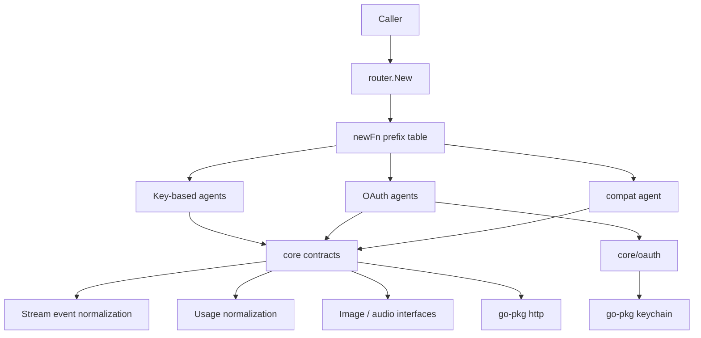

`core` defines contracts and shared behavior and knows no concrete provider; provider packages depend on `core` one-way and never on each other, with exactly two exceptions: `grokOauth` reuses `grok.RequestImage`, and `openaiCodex` reuses the `openai` image helpers.

## Module: core

Holds the Agent contract, message and usage types, and the reasoning / mode / streaming / model-classification logic every provider shares.

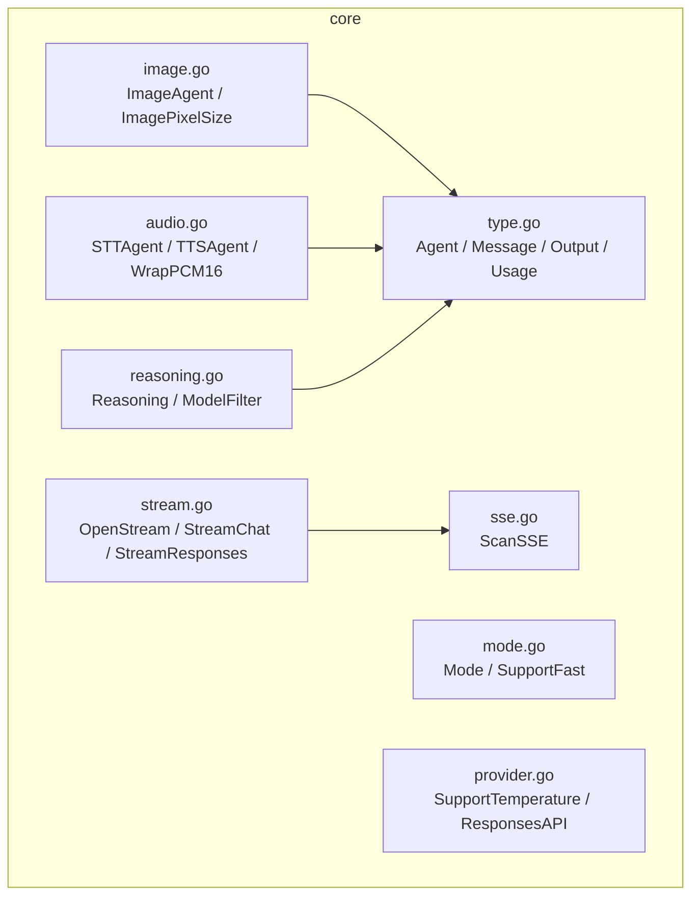

| File | Responsibility |
|---|---|
| `type.go` | `Agent` / `StreamAgent` interfaces, message and tool types, cross-provider field absorption in `Usage.UnmarshalJSON` |
| `reasoning.go` | Six reasoning levels, alias parsing, `ClampReasoning`, marker-based model classification and `ModelFilter` |
| `mode.go` | `default` / `fast` modes and per-vendor fast-tier support |
| `provider.go` | `temperature` support, Responses API routing, the shared HTTP client |
| `stream.go` / `sse.go` | SSE scanning, event normalization for both stream formats, error wrapping and read caps |
| `image.go` / `audio.go` | Optional multimodal interfaces plus pure helpers for sizing, sample rate, and WAV framing |

## Module: router

The single assembly point: it turns a `provider@model` string into a concrete Agent.

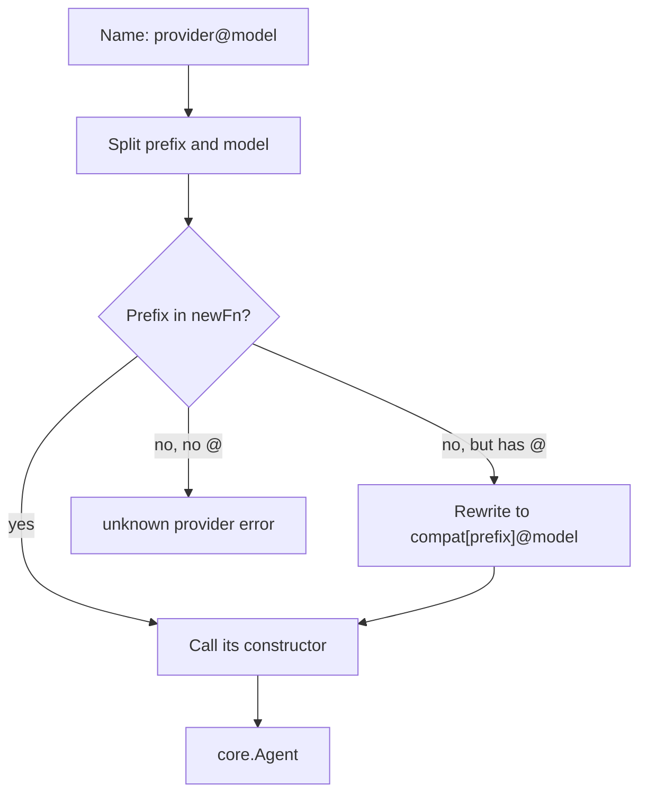

Prefixes also carry a bracketed instance name (`compat[lmstudio]@model`); `compatPrefix` extracts it and it becomes the Agent's `Name()` prefix, so one compat adapter can represent several endpoints at once.

## Module: provider adapters

Every provider package uses the same file layout; only the conversion logic differs.

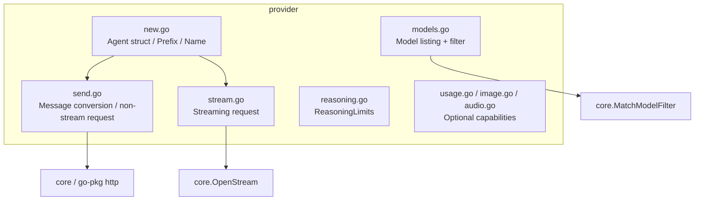

| Group | Packages | Wire format |
|---|---|---|
| OpenAI-compatible | `openai`, `deepseek`, `mistral`, `nvidia`, `openRouter`, `ollamaCloud`, `cloudflare`, `compat` | Chat Completions; newer OpenAI generations switch to Responses |
| Anthropic | `claude` | Messages API with thinking-budget conversion |
| Google | `gemini` | `:generateContent` with schema sanitization and `cachedContents` |
| xAI | `grok`, `grokOauth` | Responses API plus the image endpoints |
| OAuth proxies | `copilot`, `openaiCodex` | Vendor-internal Responses endpoints requiring a session token |

## Module: streaming

Both upstream formats collapse onto one event type, so callers never tell them apart.

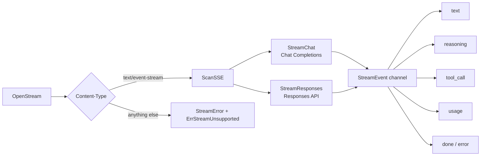

Bodies are capped by a 64 MiB `io.LimitReader`, frames quoted in errors at 512 bytes, and error bodies at 8 KiB.

## Module: oauth

All three OAuth providers share one flow skeleton and store tokens in the keychain.

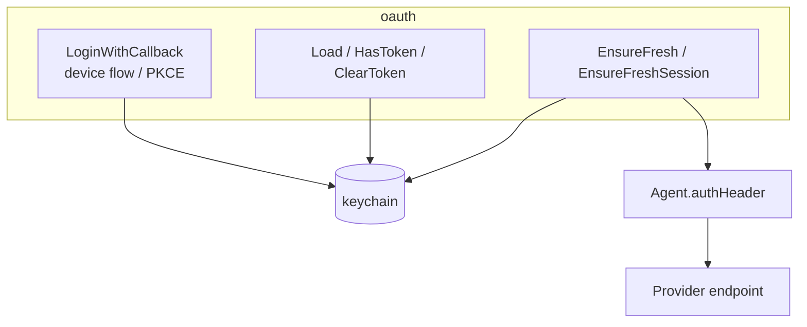

`Load` reads the current key first and falls back to the legacy `agenvoy.*` key; Copilot adds one more exchange for a short-lived session token.

## Module: multimodal

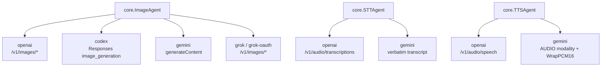

Image and audio models are the agent model; `codex` alone generates from its chat model on the backend.

## Module: model listing and filters

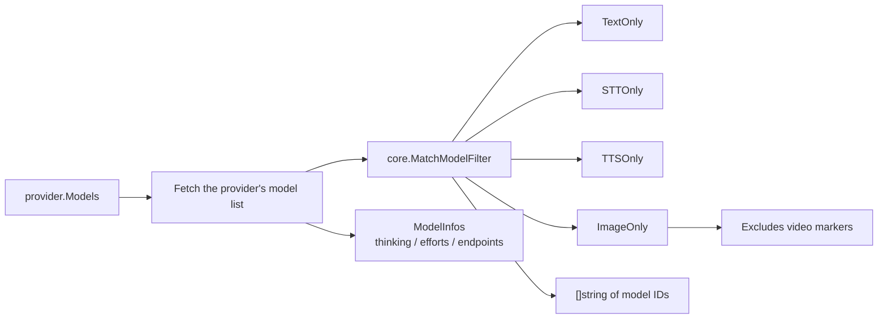

Cloudflare is the exception: it filters on the Workers AI task name (`Text Generation` / `Automatic Speech Recognition` / `Text-to-Speech`) rather than on model-ID markers.

## Data Flow

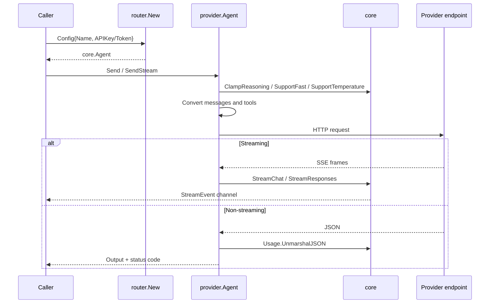

## State Machines

OAuth token lifecycle:

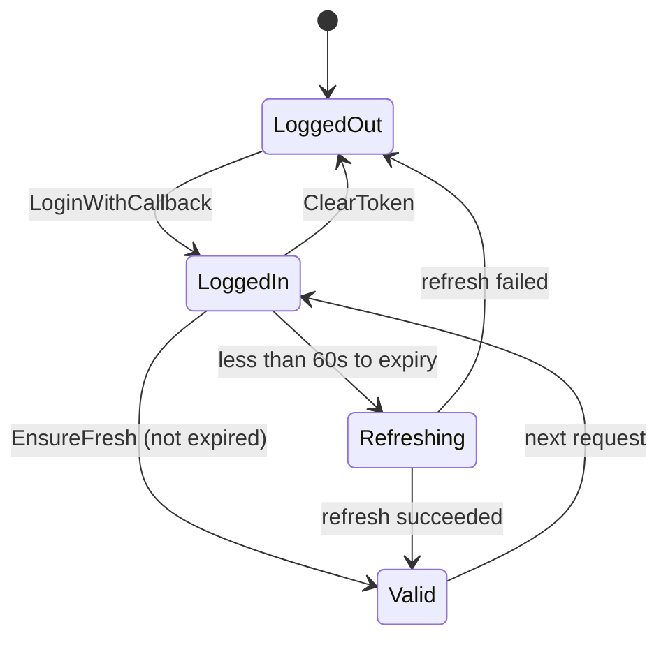

Stream event lifecycle:

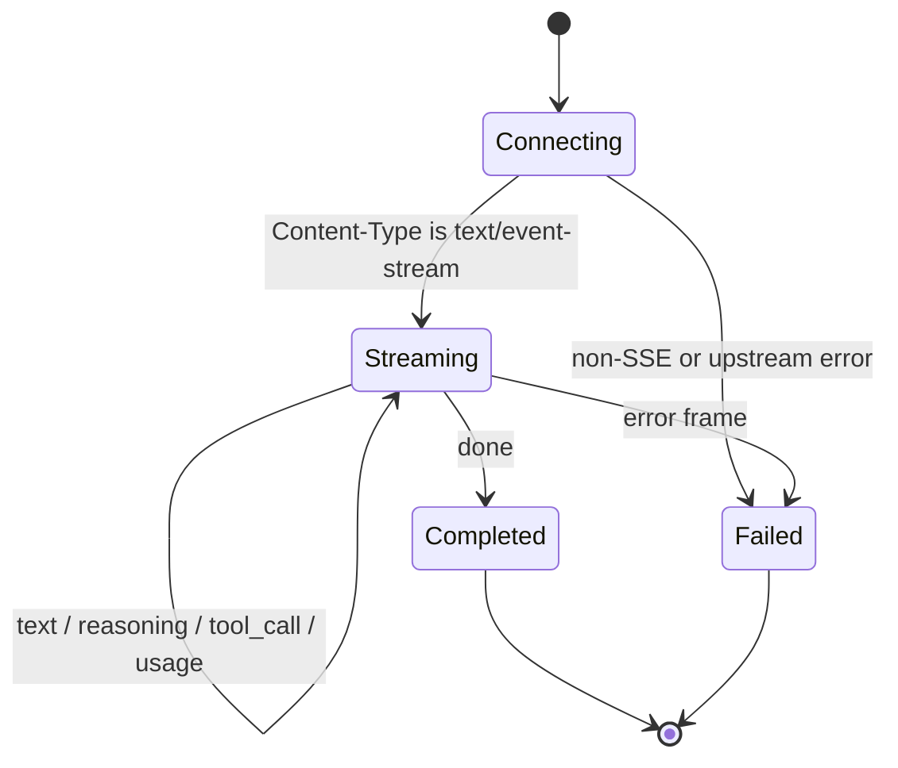

***

©️ 2026 [邱敬幃 Pardn Chiu](https://www.linkedin.com/in/pardnchiu)
