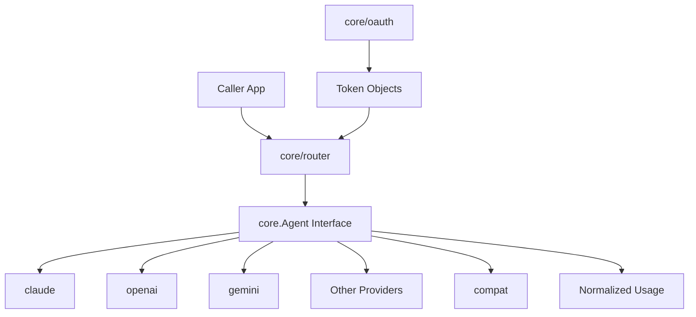
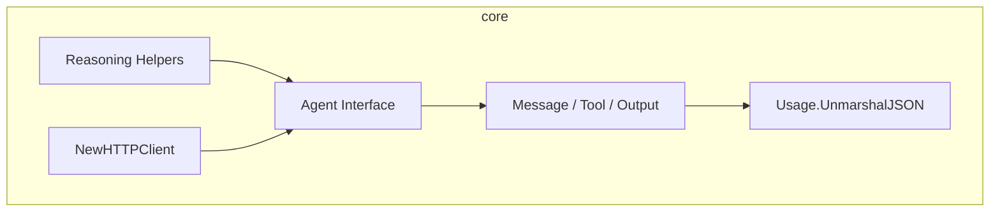
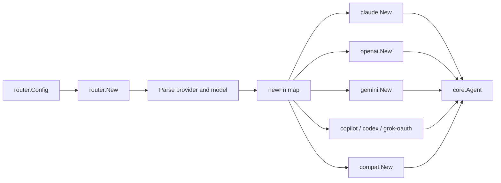
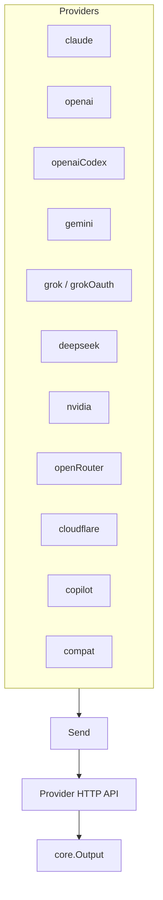
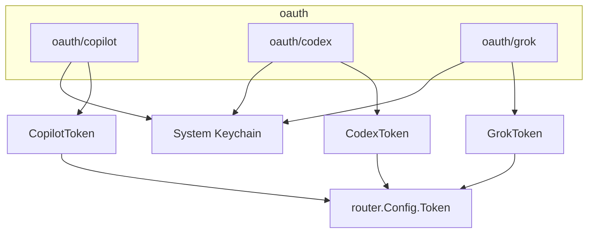
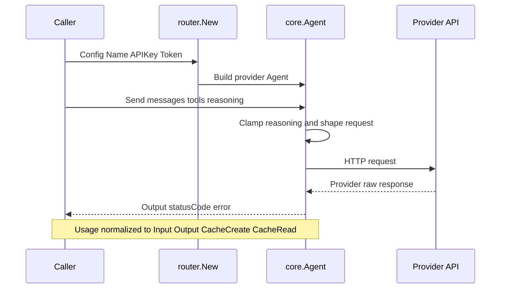
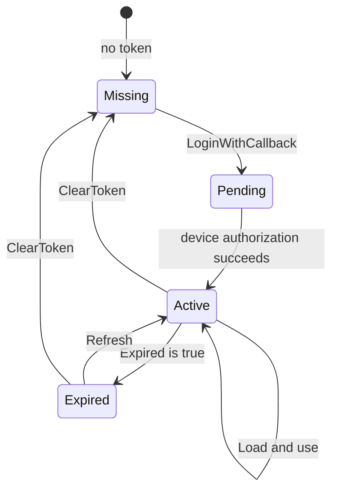

# go-llm-router - Architecture

> Back to [README](../README.md)

## Overview

## Module: core

Defines the shared contract and cross-provider helpers.

## Module: router

Parses `provider@model` and dispatches to the matching factory.

## Module: Provider Implementations

Each provider package owns auth, request shaping, and response normalization.

## Module: oauth

Provides device-code and refresh flows, optionally backed by the system keychain.

## Data Flow

## State Machine: OAuth Token

***

©️ 2026 [邱敬幃 Pardn Chiu](https://pardn.io)
