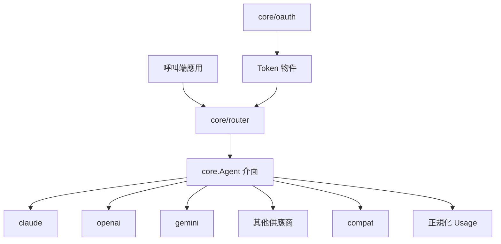
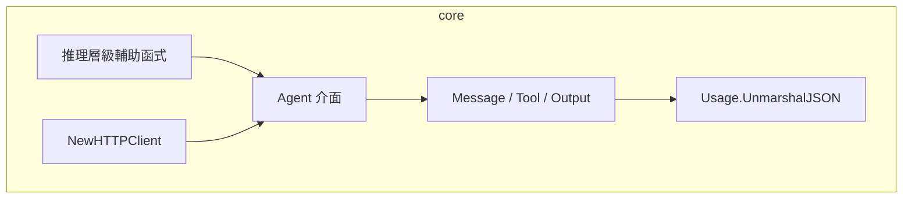
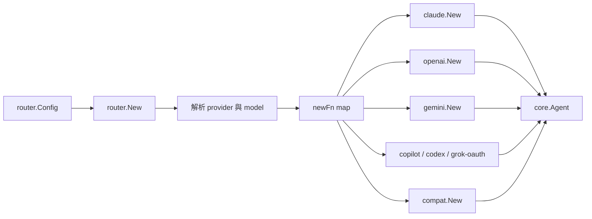
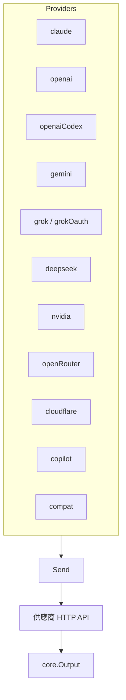
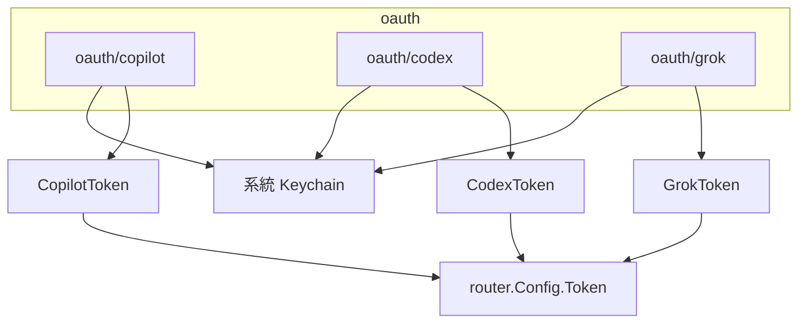
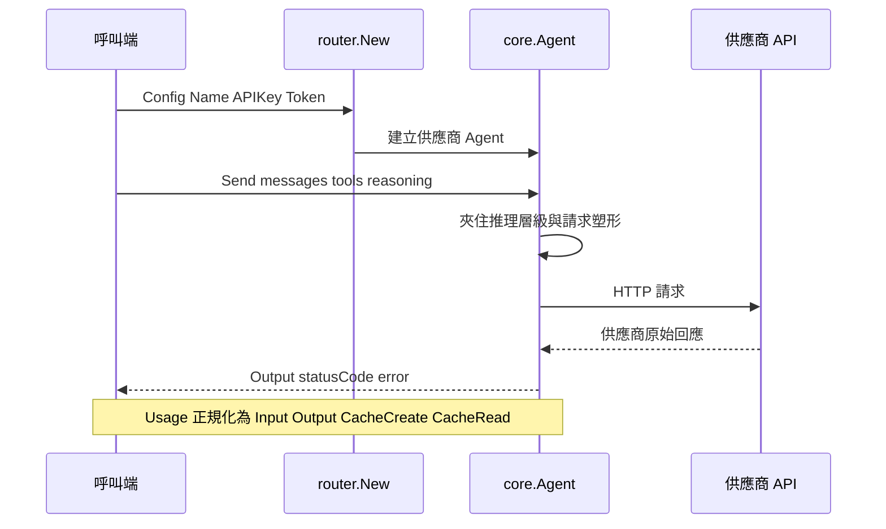
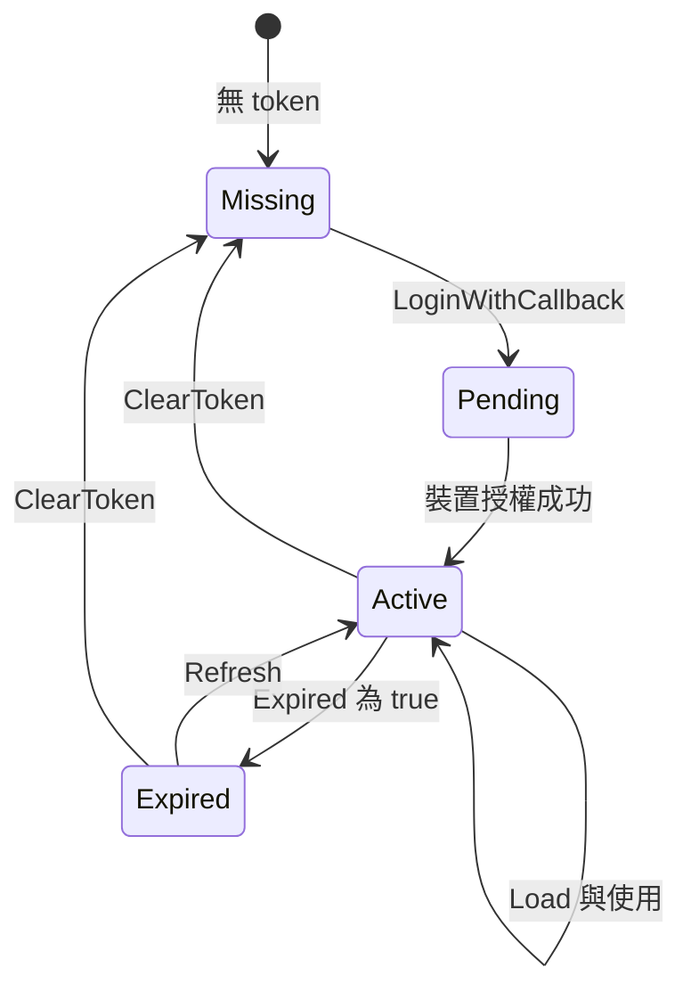

# go-llm-router - 架構

> 返回 [README](./README.zh.md)

## 概覽

## 模組：core

定義統一合約與跨供應商共用邏輯。

## 模組：router

以 `provider@model` 字串解析並分派到對應工廠。

## 模組：供應商實作

每個供應商套件負責認證、請求塑形、回應正規化。

## 模組：oauth

提供 device-code / refresh 流程，並可將 token 存入系統 keychain。

## 資料流

## 狀態機：OAuth Token

***

©️ 2026 [邱敬幃 Pardn Chiu](https://pardn.io)
