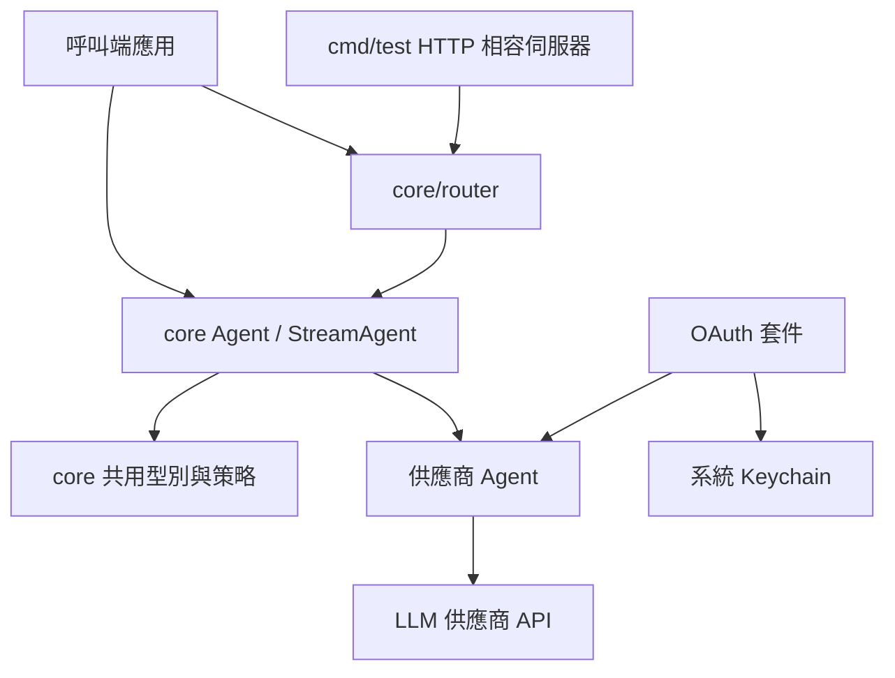
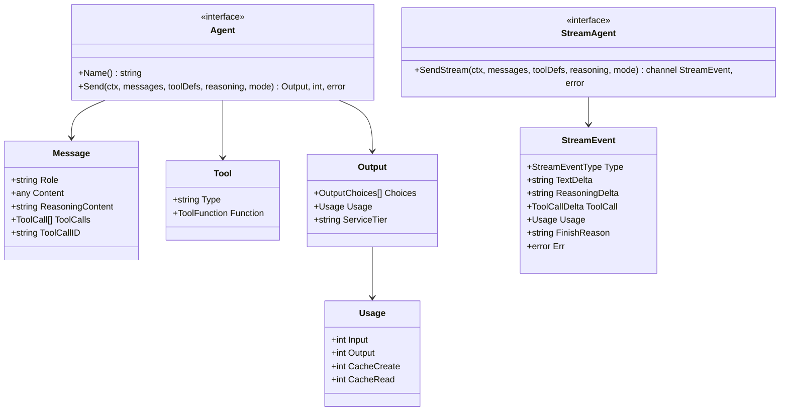
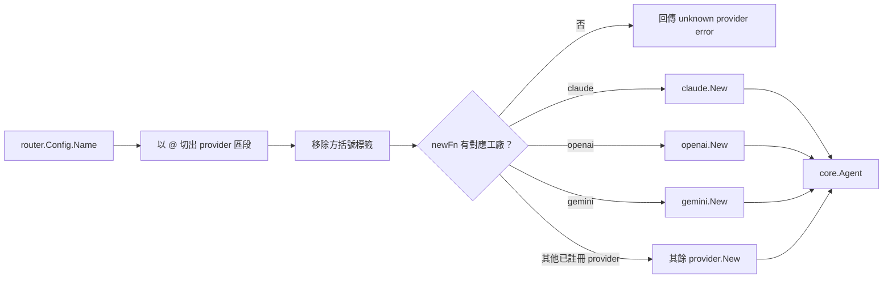
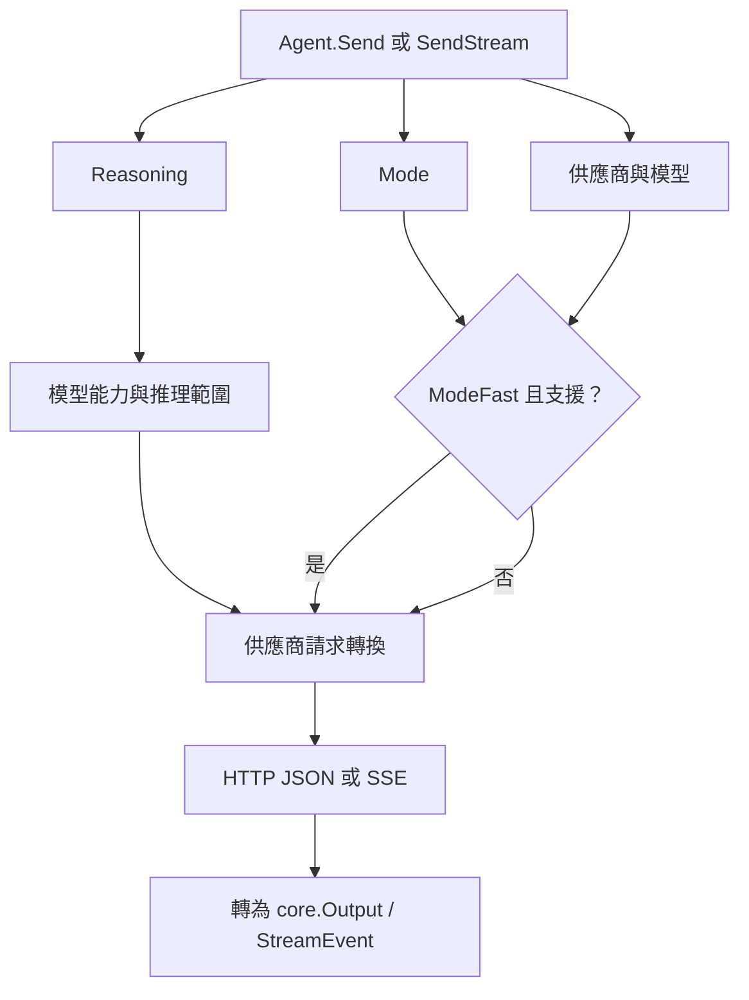
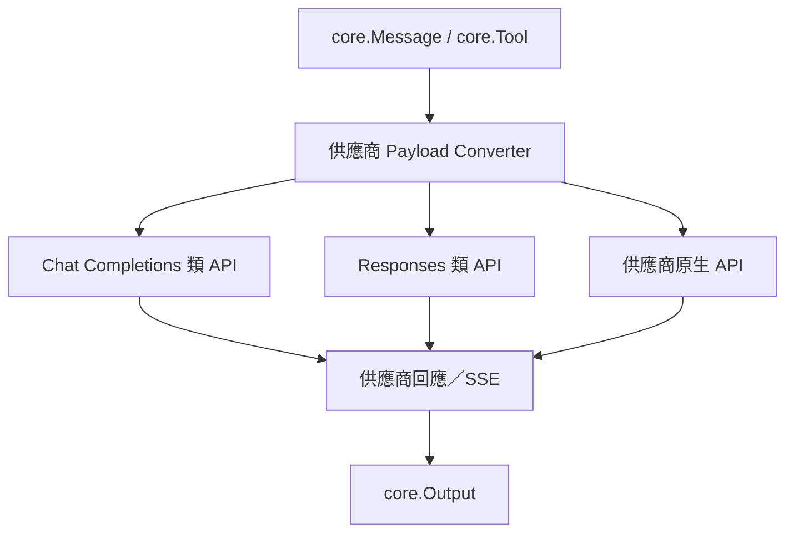
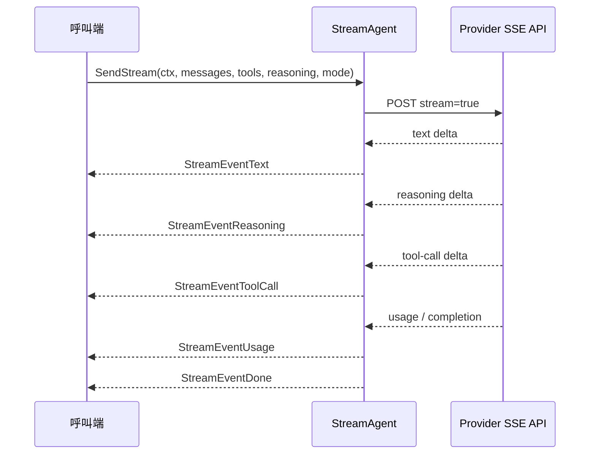
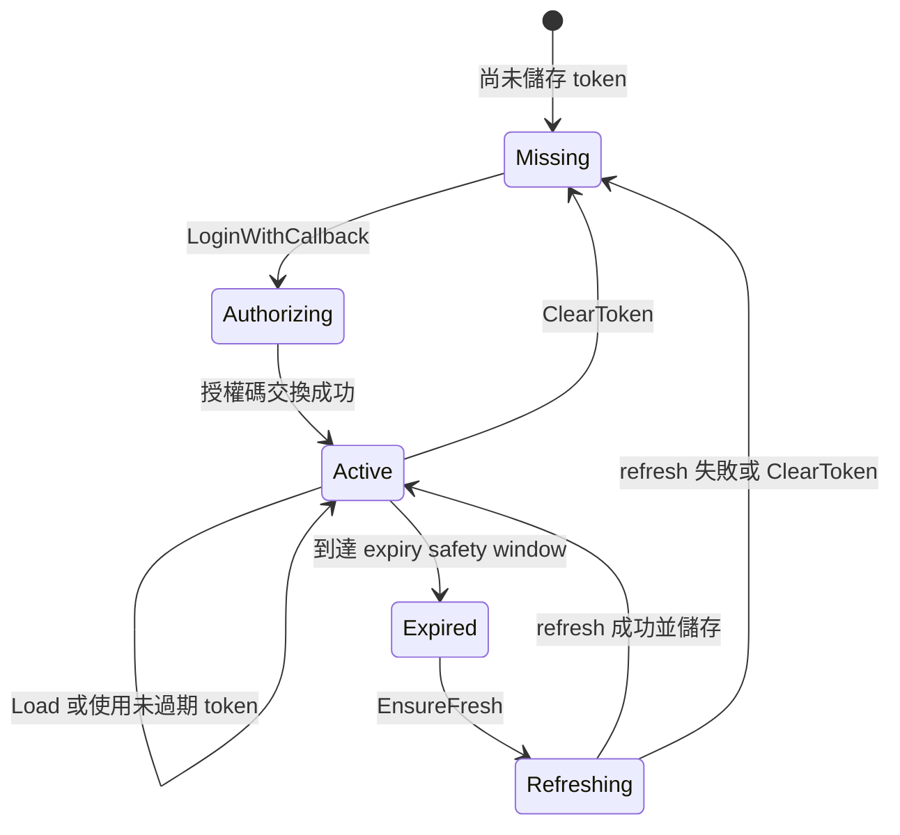
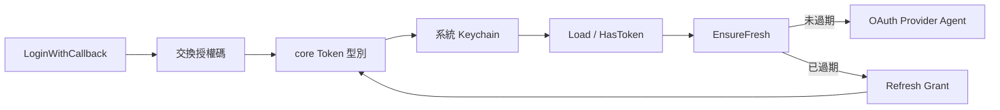
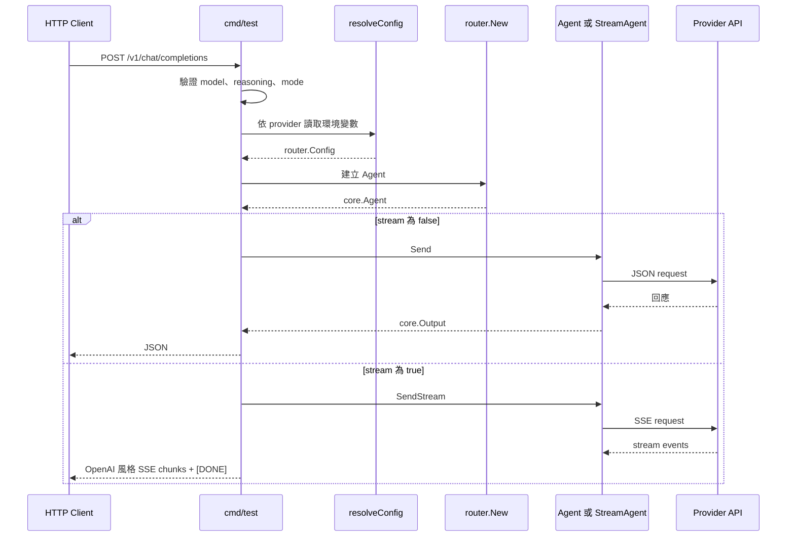
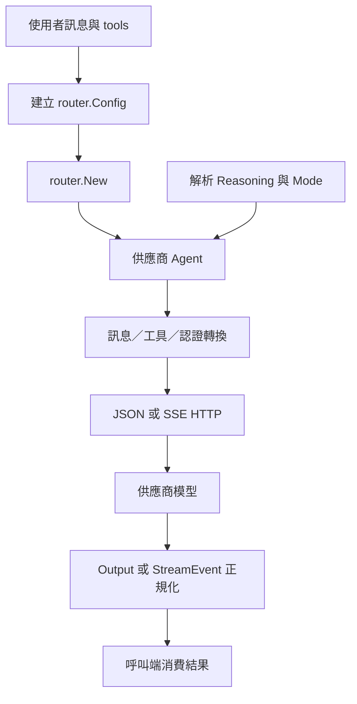

# go-llm-router - 架構

> 返回 [README](./README.zh.md)

## 概覽

`go-llm-router` 將多家 LLM 供應商封裝為一致的 `core.Agent` 與 `core.StreamAgent` 合約。呼叫端可直接建構特定供應商，也可透過 `core/router` 以 `provider@model` 字串選擇實作；所有路徑都接收統一的訊息、工具、推理層級與執行模式。

### 分層職責

| 層級 | 主要路徑 | 職責 |
|------|----------|------|
| 呼叫端 | 應用程式、`cmd/test` | 組裝訊息、選擇模型、處理同步或串流回應 |
| 路由 | `core/router` | 解析 provider 前綴，建立對應 Agent |
| 共用核心 | `core` | 定義統一合約、資料型別、推理與 fast mode 策略、HTTP client |
| 供應商 | `core/<provider>` | 認證、請求轉換、端點選擇、回應正規化與供應商特有功能 |
| OAuth | `core/oauth/*` | 登入、refresh、Keychain 儲存與 token 讀取 |

## 模組：核心合約

`core/type.go` 是跨供應商的邊界。供應商實作不應把自身 API 回傳型別暴露給呼叫端，而是轉換為 `core.Output`、`core.Usage` 與 `core.StreamEvent`。

### 核心資料契約

| 型別 | 用途 | 重要欄位／行為 |
|------|------|----------------|
| `Message` | 統一對話訊息 | `Content` 可為文字或 `[]ContentPart`；支援工具呼叫、工具結果與 reasoning 內容 |
| `Tool` | OpenAI 風格 function tool 定義 | function 名稱、描述與 JSON Schema 參數 |
| `Output` | 非串流統一回應 | choices、使用量、可選 service tier 與供應商錯誤 |
| `Usage` | 正規化 token 統計 | input、output、cache creation、cache read；可解析不同供應商計數欄位 |
| `StreamEvent` | 串流事件 | 文字、推理、工具呼叫增量、使用量、完成訊號與錯誤 |
| `Config` | 供應商建構設定 | 模型、API key、OAuth token、自訂 Base URL，以及 Cloudflare 帳號／Gateway 欄位 |

## 模組：路由器

`router.New` 接收 `router.Config`，從 `Name` 解析 provider。名稱可使用一般形式 `provider@model`，也能攜帶方括號標籤，例如 `claude[eu]@claude-opus-4-8`；標籤不影響 provider 選擇。

### 已註冊 provider 工廠

| Provider key | 建構子 | 認證／特殊設定 |
|--------------|--------|----------------|
| `claude` | `claude.New` | `APIKey` |
| `openai` | `openai.New` | `APIKey` |
| `gemini` | `gemini.New` | `APIKey` |
| `grok` | `grok.New` | `APIKey` |
| `deepseek` | `deepseek.New` | `APIKey` |
| `nvidia` | `nvidia.New` | `APIKey` |
| `openrouter` | `openrouter.New` | `APIKey` |
| `cloudflare` | `cloudflare.New` | `APIKey`、`AccountID`、`GatewayID` |
| `compat` | `compat.New` | `APIKey`、`BaseURL` |
| `copilot` | `copilot.New` | OAuth `Token` |
| `codex` | `openaiCodex.New` | OAuth `Token` |
| `grok-oauth` | `grokOauth.New` | OAuth `Token` |

## 模組：請求策略

共用核心不強迫所有 provider 使用相同 HTTP payload；它統一呼叫面的 `Reasoning` 與 `Mode`，各供應商再映射為自己的 API 欄位。

### 推理層級

`Reasoning` 由 `none`、`low`、`medium`、`high`、`xhigh`、`max` 組成，預設為 `medium`。`ParseReasoning` 也支援 `minimal`、`extra`、`ultra` 等別名。供應商實作可依模型能力套用 `ClampReasoning`、`OpenAIEffortRange` 與各自的 `effort` 映射，避免送出不支援的值。

### Fast mode

`ModeFast` 不是所有 provider 或模型都支援。`core.SupportFast` 會依 provider 與模型名稱判斷；請求 fast mode 後，供應商會使用其對應的服務等級欄位。若 API 回應顯示降級，`core.WarnFastDowngrade` 會記錄 warning。

| Provider 類型 | fast mode 映射 |
|---------------|----------------|
| Claude | `speed: "fast"` 與 fast-mode beta header |
| OpenAI | `service_tier: "fast"` |
| Grok／Grok OAuth | `service_tier: "priority"` |
| OpenRouter | 對支援模型使用 `service_tier: "priority"` |
| 其他 provider | 目前不設定 fast tier |

## 模組：供應商實作

供應商套件各自處理訊息結構、system prompt、工具格式與供應商端回應，最後回到共用型別。許多供應商會合併多段 system 訊息；OpenAI Responses、Copilot Responses、Codex 與 Grok OAuth 則將其分離為 `instructions` 與非 system input。

### Provider 職責與端點選擇

| 模組 | API 形式 | 架構特點 |
|------|----------|----------|
| `claude` | Anthropic Messages | 轉換文字、圖片與 tool use；支援 prompt cache、thinking 與 fast mode |
| `openai` | Chat Completions 或 Responses | 依模型選擇 Responses API；將 system 訊息轉為 instructions；支援 service tier |
| `gemini` | `generateContent` | 轉為 Gemini contents／function declarations；處理 cached content、schema 清理與 synthetic skill activation |
| `grok` | Chat Completions | 支援 reasoning effort 與 priority tier |
| `grokOauth` | Responses SSE | OAuth 認證、串流解析、推理／工具呼叫彙整與 priority tier |
| `copilot` | Chat Completions 或 Responses | 查詢並快取模型端點能力，再選擇 endpoint；支援同步與串流 |
| `openaiCodex` | ChatGPT Codex Responses SSE | OAuth 認證、SSE 彙整、prompt cache key 與圖片生成 API |
| `deepseek` | Chat Completions | 合併 system 訊息，補入 assistant reasoning placeholder |
| `nvidia` | Chat Completions | 合併 system 訊息，映射 reasoning effort |
| `openRouter` | Chat Completions | 保存 reasoning details，並按模型支援設定 priority tier |
| `cloudflare` | Workers AI Run | 將多模態內容平坦化、使用 Account／Gateway 設定 |
| `compat` | 自訂 Chat Completions | 對任意 OpenAI-compatible `BaseURL` 發送標準 payload |

## 模組：串流

實作 `core.StreamAgent` 的 provider 將供應商 SSE 事件轉換為 `core.StreamEvent`。呼叫端可先用 type assertion 判斷是否可串流，並不必了解各家事件名稱或工具呼叫增量格式。

### 串流事件邊界

| `StreamEventType` | 意義 |
|-------------------|------|
| `text` | 正常輸出文字增量 |
| `reasoning` | 推理摘要或 reasoning 文字增量 |
| `tool_call` | 工具呼叫的 ID、名稱或 arguments 增量 |
| `usage` | 當前或最終 token 統計 |
| `done` | 完成原因，例如 `stop` 或 `tool_calls` |
| `error` | 串流讀取、解碼或供應商端錯誤 |

目前 Claude 與 Copilot 的 Agent 提供 `SendStream`；`cmd/test` 透過同一合約轉譯 SSE。Grok OAuth 與 Codex 的 `Send` 雖在供應商端使用 SSE 取得完整回應，但其公開 Agent 方法回傳完整 `core.Output`。

## 模組：OAuth 與 token 生命週期

OAuth 套件由 provider 實作的認證 header 呼叫。Token 會以 JSON 存入系統 Keychain，並在需要時刷新；Codex 與 Grok token 的 `Expired()` 會保留 60 秒安全邊界。

| OAuth 模組 | Token 型別 | 主要保存 key |
|------------|------------|---------------|
| `core/oauth/copilot` | `core.CopilotToken` | `COPILOT_OAUTH_TOKEN`，並相容 legacy key |
| `core/oauth/codex` | `core.CodexToken` | `CODEX_OAUTH_TOKEN`，並相容 `agenvoy.codex.token` |
| `core/oauth/grok` | `core.GrokToken` | `GROK_OAUTH_TOKEN`，並相容 `agenvoy.grok-oauth.token` |

## 模組：HTTP 相容測試伺服器

`cmd/test` 將 router 包裝為一個精簡的 OpenAI 風格端點，供手動驗證使用。它不是正式 gateway，而是根據 request 的 `model` 動態選擇 provider、從環境載入認證，並轉送到統一 Agent。

### 執行與環境設定

| 項目 | 值 |
|------|----|
| 預設連接埠 | `8787`；可用 `PORT` 覆蓋 |
| 端點 | `POST /v1/chat/completions` |
| 非串流 | 呼叫 `Agent.Send`，回傳 JSON `core.Output` |
| 串流 | 對 `StreamAgent` 呼叫 `SendStream`，輸出 `text/event-stream` |
| `make test` | 執行 `go run ./cmd/test` |
| `make build` | 執行 `go build ./...` |
| `make vet` | 執行 `go vet ./...` |

## 資料流總結

***

©️ 2026 [邱敬幃 Pardn Chiu](https://pardn.io)
