# go-llm-router - 架構

> 返回 [README](./README.zh.md)

## 目錄

- [概覽](#概覽)
- [模組：core](#模組core)
- [模組：router](#模組router)
- [模組：供應商轉接層](#模組供應商轉接層)
- [模組：串流](#模組串流)
- [模組：oauth](#模組oauth)
- [模組：多模態](#模組多模態)
- [模組：模型清單與篩選](#模組模型清單與篩選)
- [資料流](#資料流)
- [狀態機](#狀態機)

## 概覽

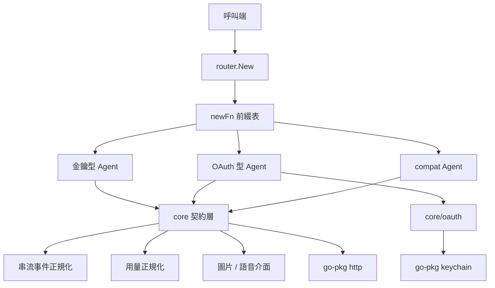

`core` 只定義契約與共用行為，不認識任何具體供應商；供應商套件單向相依 `core`，彼此不互相引用（唯二例外：`grokOauth` 共用 `grok.RequestImage`、`openaiCodex` 共用 `openai` 的圖片 helper）。

## 模組：core

定義 Agent 契約、訊息與用量型別，以及所有供應商共用的推理／模式／串流／模型分類邏輯。

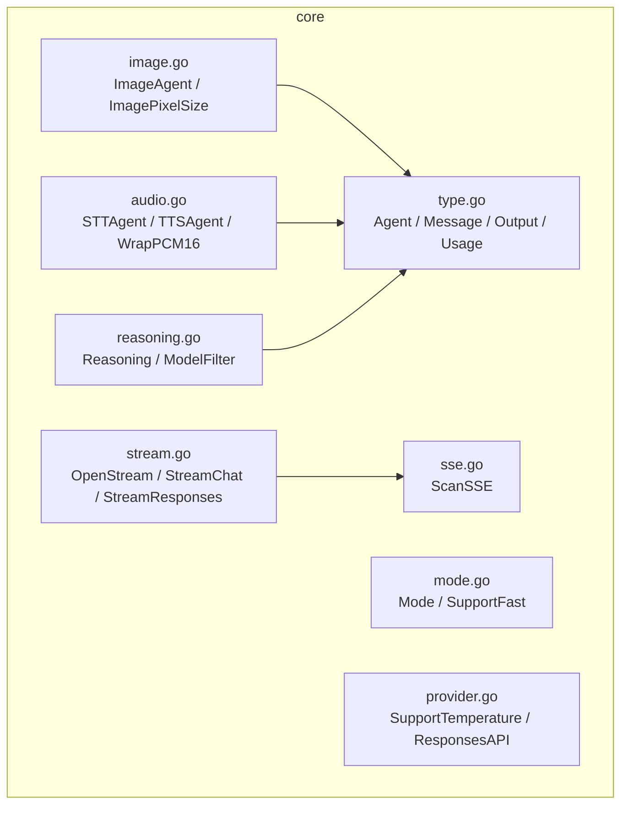

| 檔案 | 職責 |
|---|---|
| `type.go` | `Agent` / `StreamAgent` 介面、訊息與工具型別、`Usage.UnmarshalJSON` 的跨供應商欄位吸收 |
| `reasoning.go` | 六級推理等級、別名解析、`ClampReasoning`、模型標記分類與 `ModelFilter` |
| `mode.go` | `default` / `fast` 模式與各家 fast 層級的支援判斷 |
| `provider.go` | `temperature` 支援、Responses API 選路、共用 HTTP client |
| `stream.go` / `sse.go` | SSE 掃描、兩種串流格式的事件正規化、錯誤包裝與讀取上限 |
| `image.go` / `audio.go` | 多模態選用介面與尺寸／取樣率／WAV 封裝等純函式 |

## 模組：router

唯一的組裝點：把 `provider@model` 字串轉成具體 Agent。

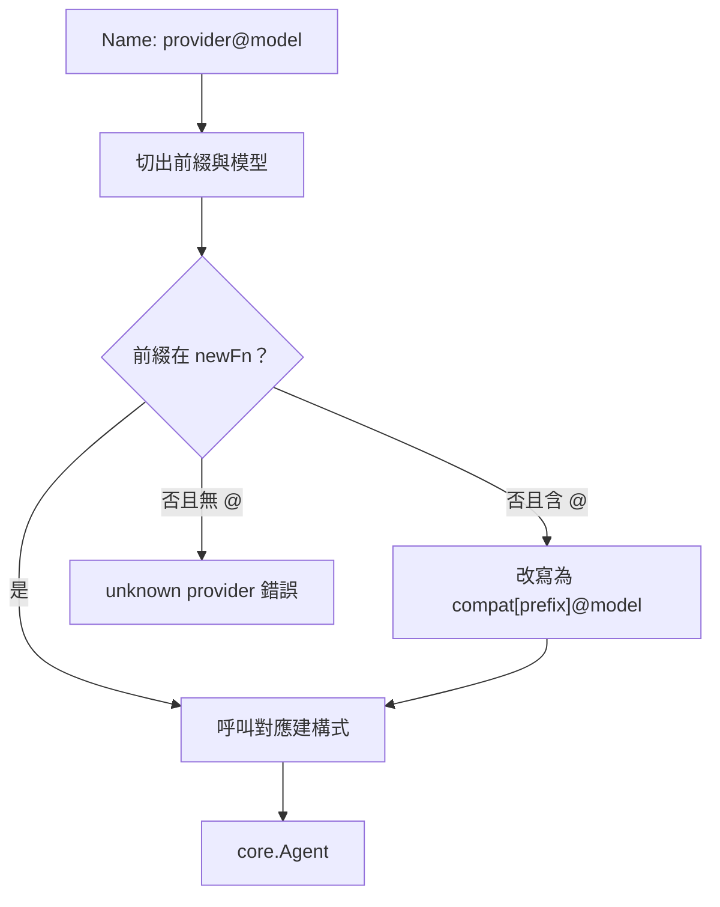

前綴另支援方括號實例名（`compat[lmstudio]@model`），`compatPrefix` 取出實例名後成為 Agent `Name()` 的前綴，讓同一個 compat 轉接層可同時代表多個端點。

## 模組：供應商轉接層

每個供應商套件的檔案佈局一致，差異只在轉換邏輯。

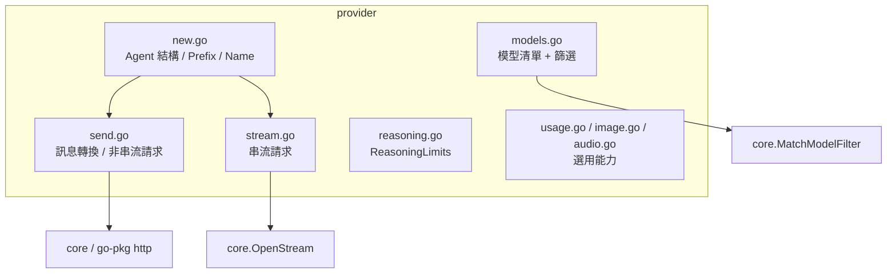

| 群組 | 套件 | 線路格式 |
|---|---|---|
| OpenAI 相容 | `openai`、`deepseek`、`mistral`、`nvidia`、`openRouter`、`ollamaCloud`、`cloudflare`、`compat` | Chat Completions；OpenAI 新世代模型改走 Responses |
| Anthropic | `claude` | Messages API，thinking 預算換算 |
| Google | `gemini` | `:generateContent`，含 schema 淨化與 `cachedContents` |
| xAI | `grok`、`grokOauth` | Responses API + 圖片端點 |
| OAuth 代理 | `copilot`、`openaiCodex` | 廠商內部 Responses 端點，需 session 權杖 |

## 模組：串流

兩種上游格式共用同一組事件型別，呼叫端不需要分辨來源。

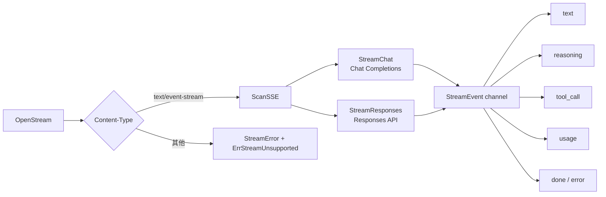

body 以 64 MiB `io.LimitReader` 封頂，錯誤訊息中的 frame 截至 512 bytes，錯誤 body 截至 8 KiB。

## 模組：oauth

三家 OAuth 供應商共用同一組流程骨架，權杖統一存放 keychain。

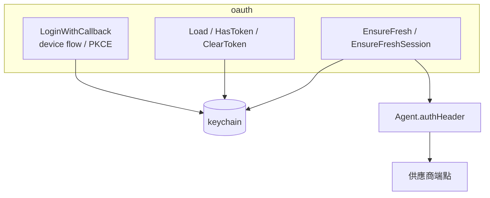

`Load` 先讀新鍵，失敗時回退舊的 `agenvoy.*` 鍵；Copilot 多一層短期 session token 交換。

## 模組：多模態

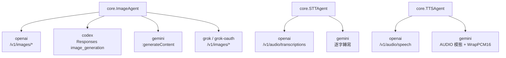

圖片與語音模型都由 agent 模型決定，唯 `codex` 由後端以對話模型生成。

## 模組：模型清單與篩選

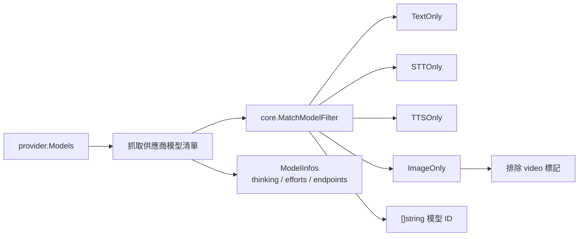

Cloudflare 例外：改以 Workers AI 的 task 名稱（`Text Generation` / `Automatic Speech Recognition` / `Text-to-Speech`）篩選，而非模型 ID 標記。

## 資料流

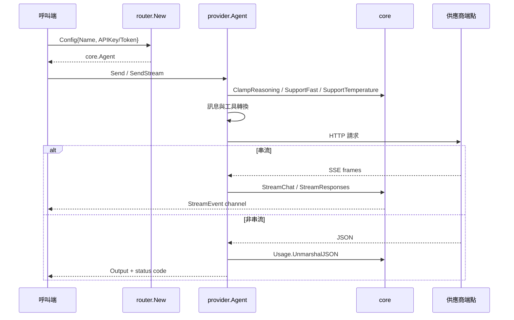

## 狀態機

OAuth 權杖生命週期：

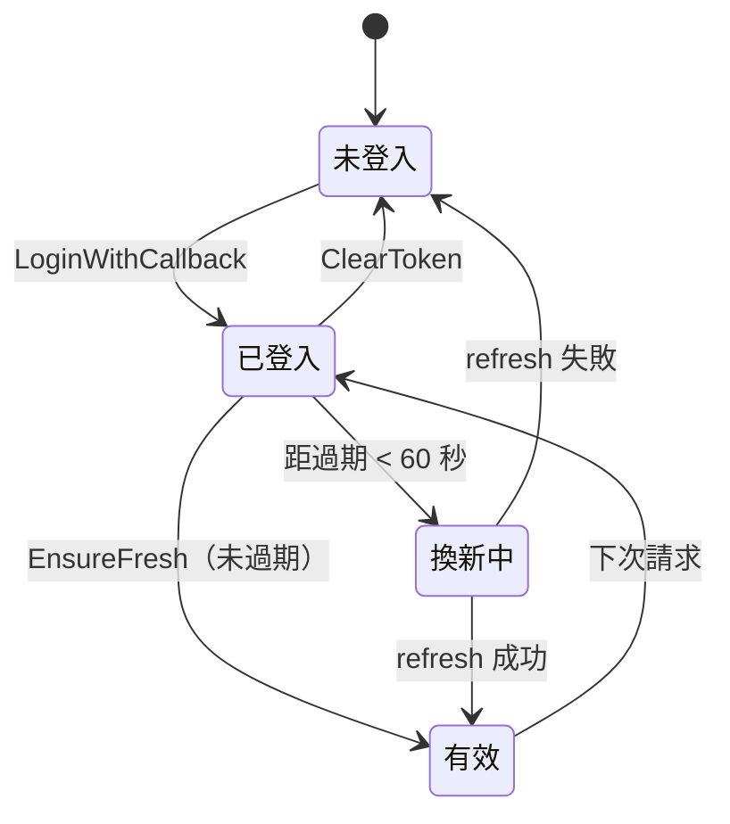

串流事件生命週期：

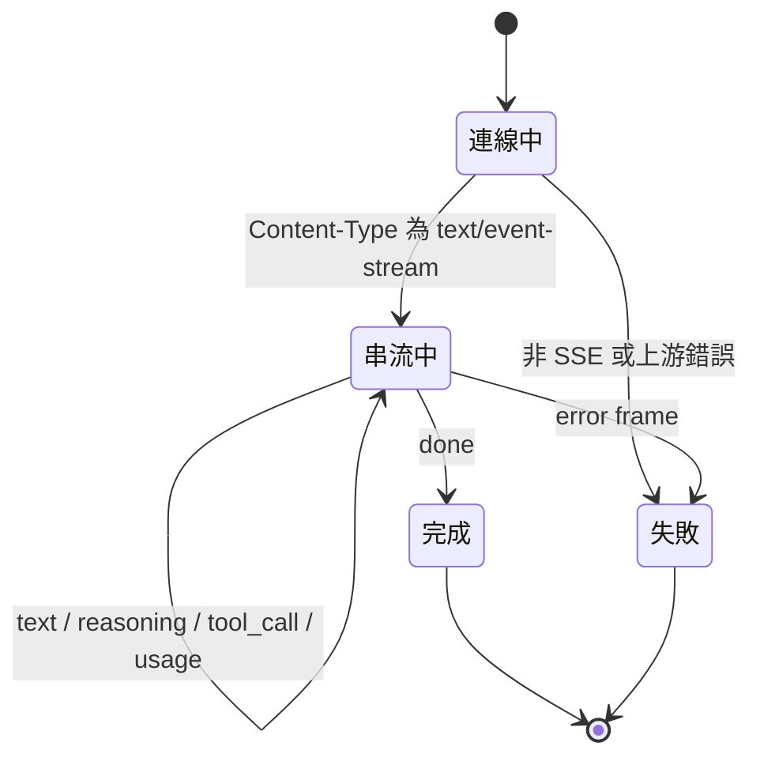

***

©️ 2026 [邱敬幃 Pardn Chiu](https://www.linkedin.com/in/pardnchiu)
